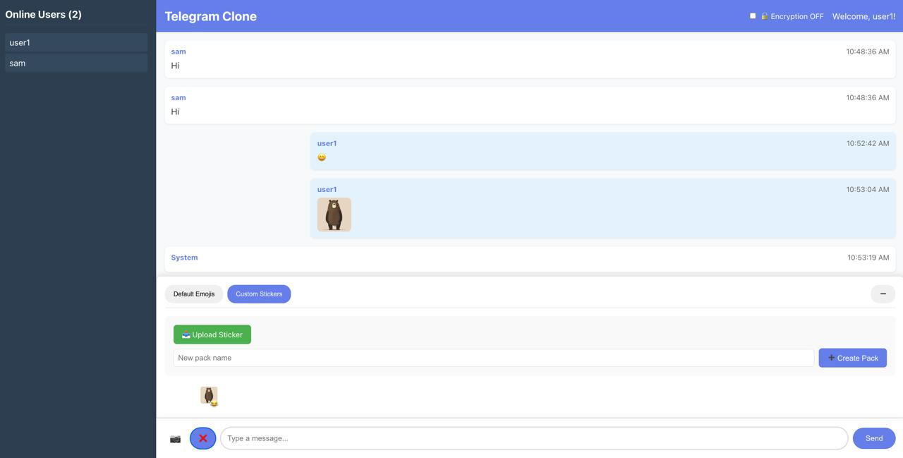

# Telegram Clone

A simple real-time messaging application inspired by Telegram, built with React and Node.js.



*Live demo of the Telegram clone with real-time messaging, custom stickers, and modern UI*

## Features

- **Real-time messaging** with Socket.io
- **Custom sticker support** with emoji matching
- **Image sharing** capabilities
- **Message encryption** (AES encryption)
- **Sticker pack management** - create and organize custom sticker packs
- **User authentication** (username-based)
- **Online user tracking**

## Tech Stack

- **Frontend**: React, Socket.io-client, CryptoJS
- **Backend**: Node.js, Express, Socket.io, Multer
- **File Storage**: Local file system
- **Encryption**: AES encryption for messages

## Project Structure

```
telegram-clone/
├── client/          # React frontend
│   ├── src/
│   │   ├── App.js   # Main application component
│   │   ├── App.css  # Styling
│   │   └── config.js # Configuration
│   └── package.json
├── server/          # Node.js backend
│   ├── index.js     # Main server file
│   ├── uploads/     # User uploaded files (not tracked)
│   └── package.json
└── start.sh         # Convenience script to start both servers
```

## Getting Started

### Prerequisites

- Node.js (v14 or higher)
- npm or yarn

### Installation

1. **Clone the repository**
   ```bash
   git clone <repository-url>
   cd telegram-clone
   ```

2. **Install dependencies**
   ```bash
   # Install backend dependencies
   cd server
   npm install
   
   # Install frontend dependencies
   cd ../client
   npm install
   ```

3. **Start the application**
   ```bash
   # From the root directory
   ./start.sh
   ```
   
   Or manually start both servers:
   ```bash
   # Terminal 1 - Backend
   cd server
   npm start
   
   # Terminal 2 - Frontend
   cd client
   npm start
   ```

4. **Access the application**
   - Frontend: http://localhost:3000
   - Backend API: http://localhost:5001

## Usage

### Basic Messaging
1. Enter a username to join the chat
2. Type messages and send them
3. See other users online in the sidebar

### Custom Stickers
1. Click the emoji button (😊) to open sticker panel
2. Click the gear icon (⚙️) to manage stickers
3. Upload custom stickers with names and emojis
4. Create custom sticker packs
5. Switch between different sticker packs

### Image Sharing
1. Click the camera button (📷) to upload images
2. Images appear inline in the chat

### Message Encryption
1. Toggle encryption on/off in the chat header
2. Encrypted messages show a lock icon (🔒)

## Screenshots

### Main Interface


The screenshot shows the main features of the application:
- **Real-time chat interface** with modern Telegram-like design
- **Custom sticker management** with emoji overlays and pack switching
- **Image sharing capabilities** with inline display
- **User list sidebar** showing online participants
- **Message encryption toggle** in the header
- **Clean, responsive UI** that works across devices

## Configuration

The application uses environment variables for configuration:

- `REACT_APP_API_URL`: Backend API URL (default: http://localhost:5001)
- `REACT_APP_SOCKET_URL`: Socket.io server URL (default: http://localhost:5001)
- `PORT`: Backend server port (default: 5001)

## Development

### File Structure

- **Backend** (`/server/index.js`): Express server with Socket.io
- **Frontend** (`/client/src/App.js`): React application
- **Uploads** (`/server/uploads/`): User uploaded files (gitignored)

### Key Features Implementation

- **Real-time messaging**: Socket.io event handling
- **File uploads**: Multer middleware for handling multipart/form-data
- **Sticker management**: Custom sticker packs with emoji associations
- **Encryption**: Client-side AES encryption with CryptoJS

## Security Notes

- Messages are encrypted client-side when encryption is enabled
- Uploaded files are stored locally (consider cloud storage for production)
- No persistent user authentication (username-based sessions)

## Contributing

1. Fork the repository
2. Create a feature branch
3. Make your changes
4. Test thoroughly
5. Submit a pull request

## License

This project is for educational purposes. Not affiliated with Telegram.